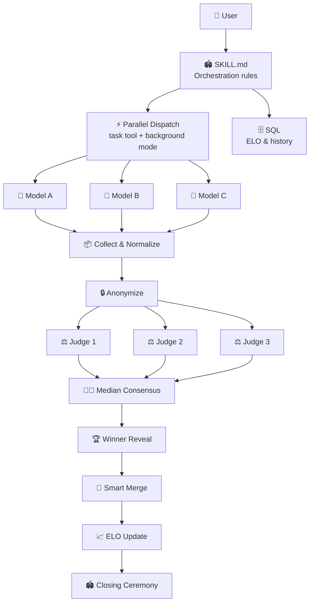

# 🏟️ Havoc Hackathon

**Pit AI models against each other. Score them sealed. Crown a winner. All built using the GitHub Copilot CLI. ⚡**

[](https://github.com/features/copilot)
[](LICENSE)
[](SECURITY.md)


---

## 🤔 What Is This?

**Havoc Hackathon** is a [Copilot CLI skill](https://docs.github.com/copilot/concepts/agents/about-copilot-cli) that turns your terminal into a competitive arena. Give it any task  -  code, copy, design, architecture, naming, anything  -  and it dispatches multiple AI models to race head-to-head, scores them with a sealed panel of judges, and declares a winner with full ceremony.

A CLI-first adversarial AI orchestration pattern designed to stress-test ideas through parallel multi-agent competition and double-blind evaluation. Two markdown files with zero lines of code.

### 💬 The Problem

You ask one AI model and hope for the best. But one model gives you one perspective with unknown quality  -  no baseline, no comparison, no way to know if the output is great or just okay. Havoc Hackathon lets you throw any idea into the arena and see how multiple AIs attack it independently, then find out which approach actually holds up under sealed evaluation.

### ⚡ What Makes It Different

- 🔒 **Sealed judging** – judges never see which model wrote what
- 🔄 **Self-correcting scores** – rubrics adapt when judges disagree
- ⚖️ **Cross-provider judges** – no all-Claude or all-GPT panels
- 🧬 **Smart merge** – cherry-picks the best pieces from every submission
- 📈 **Persistent leaderboard** – tracks which models actually deliver over time
- 🏆 **Full ceremony** – podiums, drumrolls, and dramatic reveals in your terminal
- 📄 **Two markdown files** – no servers, no API keys, no code

---

## 📦 Install (30 seconds)

### Prerequisites

- [GitHub Copilot CLI](https://github.com/github/copilot-cli) installed
- An active [Copilot subscription](https://github.com/features/copilot/plans)

### Add the Skill

#### Instant Install (no clone needed) ⚡

```bash
mkdir -p ~/.copilot/skills/havoc-hackathon ~/.copilot/agents && \
  curl -sL https://raw.githubusercontent.com/DUBSOpenHub/havoc-hackathon/main/skills/havoc-hackathon/SKILL.md \
    -o ~/.copilot/skills/havoc-hackathon/SKILL.md && \
  curl -sL https://raw.githubusercontent.com/DUBSOpenHub/havoc-hackathon/main/agents/havoc-hackathon.agent.md \
    -o ~/.copilot/agents/havoc-hackathon.agent.md && \
  echo "✅ Installed! Run /skills reload in Copilot CLI, then say: run hackathon"
```

#### Full Install (clone the repo)

```bash
git clone https://github.com/DUBSOpenHub/havoc-hackathon.git && \
  mkdir -p ~/.copilot/skills ~/.copilot/agents && \
  cp -r havoc-hackathon/skills/havoc-hackathon ~/.copilot/skills/ && \
  cp havoc-hackathon/agents/havoc-hackathon.agent.md ~/.copilot/agents/ && \
  echo "✅ Havoc Hackathon installed! Run /skills reload in Copilot CLI."
```

<details>
<summary>Other options</summary>

**Auto-discovery (run from repo):**

```bash
git clone https://github.com/DUBSOpenHub/havoc-hackathon.git
cd havoc-hackathon
copilot
```

The skill at `.github/skills/havoc-hackathon/` is automatically discovered  -  no copy needed.

</details>

---

## 🎮 Run Your First Hackathon

### Run a Hackathon

```
> run hackathon  -  build a REST API for a todo app
```

```
> run hackathon  -  review this PR for security issues
```

```
> run hackathon  -  design a landing page hero section
```

### What Happens

1. **🎬 Opening Ceremony**  -  Arena banner, model tier selection (⚡ Standard or 👑 Premium), contestant lineup, scoring rubric
2. **🏁 The Race**  -  Models dispatched in parallel with live progress commentary
3. **⚖️ Sealed Panel**  -  3 judges score anonymized submissions on 5 criteria (1-10 each)
4. **🏆 Winner Reveal**  -  Drumroll → fireworks → ASCII podium → detailed scoreboard
5. **🧬 Smart Merge**  -  Cherry-pick the best pieces from each submission
6. **📈 ELO Update**  -  Leaderboard changes with commentary
7. **🫡 Closing Ceremony**  -  Final stats, optional report export

### Customize

- Choose model tier: `"run hackathon with premium models"` or `"run hackathon with standard models"`
- Choose specific models: `"hackathon with opus, gemini, and codex"`
- Set custom rubric: `"judge on security, performance, and readability"`
- Tournament mode: `"bracket tournament with 6 models"`
- Show stats: `"show leaderboard"` or `"show stats"` anytime

<details>
<summary><strong>📼 Example Run  -  Full Hackathon Transcript (Premium Tier)</strong></summary>

```
> run hackathon  -  write a Mass Effect themed motivational quote for open source developers

╔══════════════════════════════════════════════════════════════════╗
║              ⚡  H A V O C   H A C K A T H O N  ⚡              ║
║                                                                  ║
║  🏟️  THE ARENA IS READY. THE AI MODELS ARE READY TO COMPETE.  🏟️  ║
╚══════════════════════════════════════════════════════════════════╝

🎯 TASK: Write a Mass Effect themed motivational quote for open source developers

👑 CONTESTANTS:
  🔵 Claude Opus 4.6       (Premium)
  🟢 Codex (GPT-5.3)       (Premium)
  🟡 Gemini 3 Pro          (Premium)

⚖️ RUBRIC: Clarity · Simplicity · Relevance · Inspiration · Memorability (each /10)

3... 2... 1... GO! 🏁

🏁 ALL MODELS CROSSED THE FINISH LINE!
  🔵 Claude Opus 4.6     ✅ 4s ⚡
  🟢 Codex (GPT-5.3)     ✅ 3s ⚡ Speedrun!
  🟡 Gemini 3 Pro        ✅ 10s

⚖️ The panel convenes... 🔒 Submissions anonymized. No favoritism. No mercy.
   👨‍⚖️ Judges: Claude Opus 4.5 · GPT-5.2 · Codex Max (GPT-5.1)

🥁 ... 🥁🥁 ... 🥁🥁🥁

🎆🎆🎆 AND THE WINNER IS... 🎆🎆🎆

╔══════════════════════════════════════════════════════════════════╗
║   🏆  CHAMPION:  Claude Opus 4.6                                ║
║   SCORE: 43/50  ·  CONSENSUS: STRONG  ·  ALL JUDGES AGREED     ║
╚══════════════════════════════════════════════════════════════════╝

🏅 THE PODIUM

                    🥇
                 ┌──────┐
                 │CLAUDE│
                 │ OPUS │
                 │ 4.6  │
          🥈     │  43  │     🥉
       ┌──────┐ │      │ ┌──────┐
       │CODEX │ │      │ │GEMINI│
       │ 5.3  │ │      │ │3 PRO │
       │  37  │ │      │ │  35  │
       └──────┘ └──────┘ └──────┘

📊 DETAILED SCOREBOARD
  Category      🥇 Claude Opus  🥈 Codex 5.3  🥉 Gemini 3 Pro
  Clarity            9              8              7
  Simplicity         8              7              5
  Relevance          9              8              8
  Inspiration        9              7              8
  Memorability       8              7              7
  TOTAL           43/50          37/50          35/50

📈 ELO UPDATE
  📈 Claude Opus 4.6   1532  (+32) ⬆️
  ➡️  Codex (GPT-5.3)   1500  (±0)
  📉 Gemini 3 Pro      1468  (-32) ⬇️

🧬 How would you like to apply the improvements?
  > Smart merge ⭐ (apply high-confidence improvements) ← SELECTED
  > Winner's improvements only
  > Review each individually
  > Discard all

✅ Merged! Here's what changed:
  Applied Claude Opus 4.6's quote with Codex's tighter phrasing

╔══════════════════════════════════════════════════════════════════╗
║                    🏟️  HACKATHON COMPLETE  🏟️                    ║
╠══════════════════════════════════════════════════════════════════╣
║  📋 Task:    Mass Effect motivational quote                     ║
║  🏆 Winner:  Claude Opus 4.6 (43/50)                            ║
║  🧬 Merged:  Smart merge — best of Opus + Codex phrasing        ║
║  📈 ELO:     Opus climbs to 1532                                ║
╚══════════════════════════════════════════════════════════════════╝

📼 Want the highlight reel?
  > Save replay
  > Skip

GG WP! Scores logged. ELOs updated. May your diffs be clean and your builds be green. 💚 Until next time... 🫡
```

</details>

---

## 🔧 How It Works



---

## 📁 Project Structure

```
havoc-hackathon/
├── .github/
│   ├── CODEOWNERS                    ← 👑 Code ownership rules
│   ├── ISSUE_TEMPLATE/               ← 🐛 Bug & feature templates
│   ├── PULL_REQUEST_TEMPLATE.md      ← 📝 PR checklist
│   ├── dependabot.yml                ← 🤖 Automated dependency updates
│   ├── workflows/
│   │   └── validate.yml              ← ✅ CI: SKILL.md sync + YAML check
│   └── skills/
│       └── havoc-hackathon/
│           └── SKILL.md              ← 🏟️ Auto-discovered skill
├── agents/
│   └── havoc-hackathon.agent.md      ← 🤖 Agent config (for task tool)
├── docs/
│   ├── TECHNICAL.md                  ← 🔬 Technical deep-dive
│   └── images/                       ← 📷 Screenshots
├── skills/
│   └── havoc-hackathon/
│       ├── SKILL.md                  ← 🏟️ Canonical skill source
│       └── catalog.yml               ← 📋 Catalog metadata
├── .gitignore
├── CHANGELOG.md                      ← 📋 Version history
├── CODE_OF_CONDUCT.md                ← 🤝 Contributor Covenant
├── CONTRIBUTING.md                   ← 🛠️ How to contribute
├── LICENSE                           ← 📄 MIT
├── SECURITY.md                       ← 🔒 Security policy
├── TESTING.md                        ← 🧪 Conversation playbooks & QA
└── README.md                         ← 👋 You are here!
```

---

## 🤖 Models

| Display Name | Model ID | Tier |
|-------------|----------|------|
| Claude Opus 4.6 | `claude-opus-4.6` | Premium |
| Claude Opus 4.6 (Fast) | `claude-opus-4.6-fast` | Premium |
| Claude Opus 4.6 (1M) | `claude-opus-4.6-1m` | Premium |
| Claude Opus 4.5 | `claude-opus-4.5` | Premium |
| Codex Max (GPT-5.1) | `gpt-5.1-codex-max` | Standard |
| Gemini 3 Pro | `gemini-3-pro-preview` | Standard |
| Claude Sonnet 4.6 | `claude-sonnet-4.6` | Standard |
| Claude Sonnet 4.5 | `claude-sonnet-4.5` | Standard |
| Codex (GPT-5.3) | `gpt-5.3-codex` | Standard |
| Codex (GPT-5.2) | `gpt-5.2-codex` | Standard |
| GPT-5.2 | `gpt-5.2` | Standard |
| GPT-5.1 | `gpt-5.1` | Standard |

**Default contestants (Standard ⚡):** Claude Sonnet 4.6, Codex Max (GPT-5.1), GPT-5.2
**Default contestants (Premium 👑):** Codex (GPT-5.3), Claude Opus 4.6, Gemini 3 Pro
**Default judges (Standard ⚡):** Claude Sonnet 4.5, Codex (GPT-5.2), GPT-5.1
**Default judges (Premium 👑):** Claude Opus 4.5, GPT-5.2, Codex Max (GPT-5.1)

> 💡 **Tip:** Standard models are selected by default. Say `"run hackathon with premium models"` to use the heavy hitters.

---

## 🔒 Security

See [SECURITY.md](SECURITY.md) for our security policy and how to report vulnerabilities.

---

## 🤝 Contributing

Got ideas to make the arena even better? 🎨 See [CONTRIBUTING.md](CONTRIBUTING.md) for the full guide!

**Quick ways to help:**
- 🐛 [Report a bug](https://github.com/DUBSOpenHub/havoc-hackathon/issues/new?template=bug_report.md)
- 💡 [Suggest a feature](https://github.com/DUBSOpenHub/havoc-hackathon/issues/new?template=feature_request.md)

See [TESTING.md](TESTING.md) for conversation playbooks and QA checklists.

---

## 📄 License

[MIT](LICENSE)  -  use it, share it, remix it! 🎶

---

## 🐙 Built with Love

Created with 💜 by [DUBSOpenHub](https://github.com/DUBSOpenHub) to help more people discover the joy of GitHub Copilot CLI.

**Let's build!** 🚀✨
