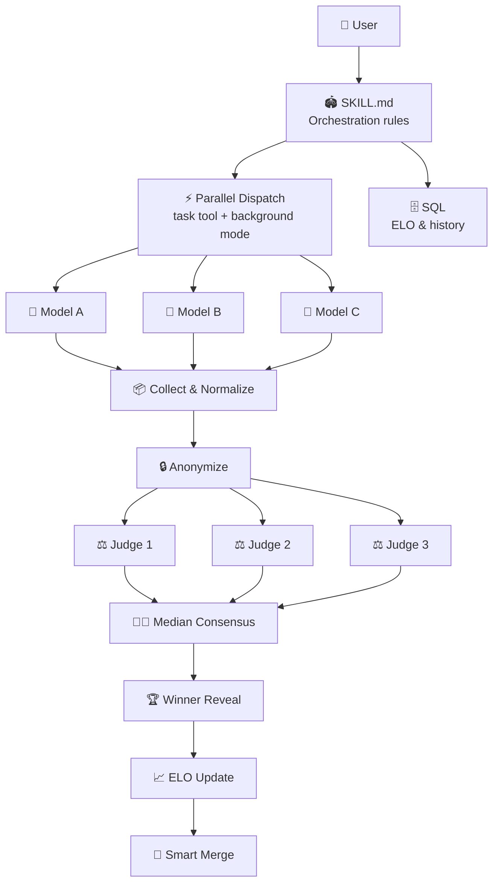

# 🏟️ Havoc Hackathon

> **Unleash AI models against each other on any task** — competitive multi-model orchestration with sealed judging, ELO tracking, and maximum drama! ⚡

[](https://github.com/features/copilot)
[](LICENSE)
[](SECURITY.md)

---

## 🤔 What Is This?

**Havoc Hackathon** is a [Copilot CLI skill](https://docs.github.com/copilot/concepts/agents/about-copilot-cli) that turns your terminal into a competitive arena. Give it any task — code, design, review, branding — and it dispatches multiple AI models to compete head-to-head, scores them with a sealed panel, and declares a winner with esports-level drama. 🎤🔥

### Key Features

- 🏁 **Parallel model dispatch** — 3+ models race on the same task simultaneously
- ⚖️ **Sealed panel judging** — 3 judge models score anonymized submissions
- 📈 **ELO rating system** — persistent leaderboard tracks model performance across sessions
- 🧬 **Intelligent merge** — cherry-pick the best components from each submission
- 🏆 **Full ceremony** — ASCII podiums, dramatic reveals, color commentary
- 🔄 **Adaptive rubrics** — scoring criteria adjust based on task type and competition tightness

---

## 📦 Installation

### Prerequisites

- [GitHub Copilot CLI](https://github.com/github/copilot-cli) installed
- An active [Copilot subscription](https://github.com/features/copilot/plans)

### Add the Skill

#### Option A: Personal Skill (works everywhere) ⭐ Recommended

Clone the repo and copy the skill to your personal skills directory:

```bash
git clone https://github.com/DUBSOpenHub/havoc-hackathon.git
mkdir -p ~/.copilot/skills
cp -r havoc-hackathon/skills/havoc-hackathon ~/.copilot/skills/
```

Then in a Copilot CLI session, run `/skills reload` to pick it up.

#### Option B: Project Skill (auto-discovered)

Clone the repo and start Copilot CLI from inside it:

```bash
git clone https://github.com/DUBSOpenHub/havoc-hackathon.git
cd havoc-hackathon
copilot
```

The skill at `.github/skills/havoc-hackathon/` is automatically discovered.

#### Option C: Add the Agent Too

For subprocess-based execution (via the `task` tool), also copy the agent:

```bash
mkdir -p ~/.copilot/agents
cp havoc-hackathon/agents/havoc-hackathon.agent.md ~/.copilot/agents/
```

---

## 🎮 Usage

### Run a Hackathon

```
> run hackathon — build a REST API for a todo app
```

```
> run hackathon — review this PR for security issues
```

```
> run hackathon — design a landing page hero section
```

### What Happens

1. **🎬 Opening Ceremony** — Arena banner, task summary, contestant lineup, scoring rubric
2. **🏁 The Race** — Models dispatched in parallel with live progress commentary
3. **⚖️ Sealed Panel** — 3 judges score anonymized submissions on 5 criteria (1-10 each)
4. **🏆 Winner Reveal** — Drumroll → fireworks → ASCII podium → detailed scoreboard
5. **🧬 Smart Merge** — Cherry-pick the best pieces from each submission
6. **📈 ELO Update** — Leaderboard changes with commentary
7. **🫡 Closing Ceremony** — Final stats, optional report export

### Modes

| Mode | What It Does |
|------|-------------|
| **Build** | Models write code independently, results compared |
| **Review** | Models analyze the same code, findings ensembled |
| **Design** | Models propose designs, judged on creativity + UX |
| **Branding** | Models compete on copy, naming, messaging |

### Customize

- Choose specific models: `"hackathon with opus, gemini, and codex"`
- Set custom rubric: `"judge on security, performance, and readability"`
- Tournament mode: `"bracket tournament with 6 models"`

---

## 🏗️ Architecture



---

## 🏗️ Project Structure

```
havoc-hackathon/
├── .github/
│   ├── CODEOWNERS                    ← 👑 Code ownership rules
│   ├── ISSUE_TEMPLATE/               ← 🐛 Bug & feature templates
│   ├── PULL_REQUEST_TEMPLATE.md      ← 📝 PR checklist
│   ├── dependabot.yml                ← 🤖 Automated dependency updates
│   └── skills/
│       └── havoc-hackathon/
│           └── SKILL.md              ← 🏟️ Auto-discovered skill
├── agents/
│   └── havoc-hackathon.agent.md      ← 🤖 Agent config (for task tool)
├── skills/
│   └── havoc-hackathon/
│       ├── SKILL.md                  ← 🏟️ Canonical skill source
│       └── catalog.yml               ← 📋 Catalog metadata
├── .gitignore
├── CHANGELOG.md                      ← 📋 Version history
├── CODE_OF_CONDUCT.md                ← 🤝 Contributor Covenant
├── CONTRIBUTING.md                   ← 🛠️ How to contribute
├── LICENSE                           ← 📄 MIT
├── SECURITY.md                       ← 🔒 Security policy
├── TESTING.md                        ← 🧪 Conversation playbooks & QA
└── README.md                         ← 👋 You are here!
```

---

## 📊 Available Models

| Display Name | Model ID | Tier |
|-------------|----------|------|
| Claude Sonnet 4.5 | `claude-sonnet-4.5` | Standard |
| Claude Sonnet 4.6 | `claude-sonnet-4.6` | Standard |
| Claude Sonnet 4 | `claude-sonnet-4` | Standard |
| Claude Haiku 4.5 | `claude-haiku-4.5` | Fast |
| Claude Opus 4.6 | `claude-opus-4.6` | Premium |
| Codex (GPT-5.1) | `gpt-5.1-codex` | Standard |
| Codex (GPT-5.2) | `gpt-5.2-codex` | Standard |
| GPT-5.1 | `gpt-5.1` | Standard |
| GPT-5.2 | `gpt-5.2` | Standard |
| Gemini 3 Pro | `gemini-3-pro-preview` | Standard |
| GPT-4.1 | `gpt-4.1` | Fast |
| GPT-5 mini | `gpt-5-mini` | Fast |

**Default contestants:** Claude Sonnet 4.5, Codex (GPT-5.2), Gemini 3 Pro
**Default judges:** Claude Opus 4.6, GPT-5.1, Claude Sonnet 4

---

## 🔒 Security

See [SECURITY.md](SECURITY.md) for our security policy and how to report vulnerabilities.

---

## 🤝 Contributing

Got ideas to make the arena even better? 🎨 See [CONTRIBUTING.md](CONTRIBUTING.md) for the full guide!

**Quick ways to help:**
- 🐛 [Report a bug](https://github.com/DUBSOpenHub/havoc-hackathon/issues/new?template=bug_report.md)
- 💡 [Suggest a feature](https://github.com/DUBSOpenHub/havoc-hackathon/issues/new?template=feature_request.md)

See [TESTING.md](TESTING.md) for conversation playbooks and QA checklists.

---

## 📄 License

[MIT](LICENSE) — use it, share it, remix it! 🎶

---

## 🐙 Built with Love

Made with 💜 by [DUBSOpenHub](https://github.com/DUBSOpenHub) — because even AI deserves a little competition. 🏟️⚡

**GG WP!** 🫡
