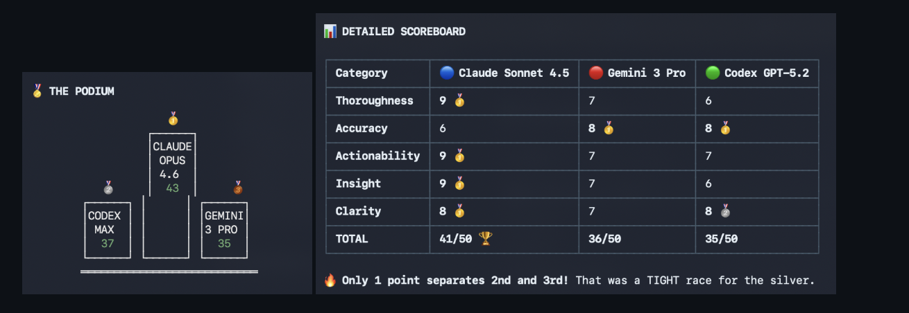
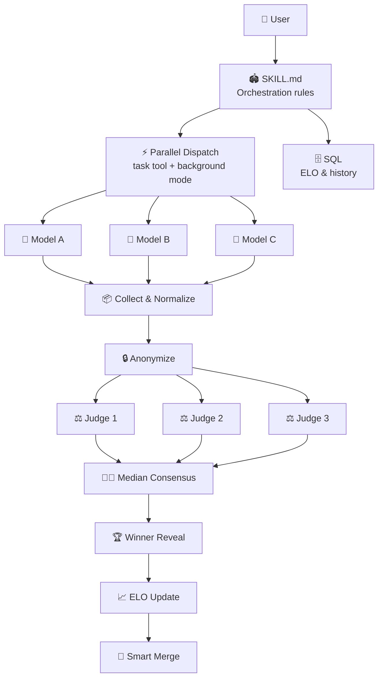

# 🏟️ Havoc Hackathon

> A **CLI-native adversarial AI orchestration harness** designed to stress-test ideas through parallel multi-agent competition and blind adjudication. ⚡

[](https://github.com/features/copilot)
[](LICENSE)
[](SECURITY.md)

<p align="center">
  
</p>

---

## 🤔 What Is This?

**Havoc Hackathon** is a [Copilot CLI skill](https://docs.github.com/copilot/concepts/agents/about-copilot-cli) that turns your terminal into a competitive arena. Give it any task  -  code, design, review, branding  -  and it dispatches multiple AI models to compete head-to-head, scores them with a sealed panel, and declares a winner with esports-level drama. 🎤🔥

### 💡 Why This Exists

I wanted a place to stress-test any idea  -  not just code, but copy, designs, architecture decisions, naming, anything. Instead of asking one model and hoping for the best, Havoc Hackathon lets you throw an idea into the arena and see how multiple AIs attack it independently, then find out which approach actually holds up under blind evaluation.

### 🧬 Design Philosophy

Havoc Hackathon is an **adversarial orchestration harness**  -  not just a wrapper around model APIs. The design is intentional:

- **Why adversarial?**  -  A single model gives you one perspective. Pitting models against each other on the same task with identical prompts exposes blind spots, surfaces diverse approaches, and produces objectively better output through competitive pressure.
- **Why blind adjudication?**  -  Judges never see which model produced which submission. Outputs are anonymized and randomly shuffled before scoring. Three independent judge models score each submission, and the final score is the **median consensus**  -  eliminating individual judge bias. This is the same principle behind double-blind peer review, applied to AI.
- **Why parallel?**  -  All contestants are dispatched simultaneously via background agents. No model sees another's work. No sequential contamination. The competition is fair by construction.
- **Why CLI-native?**  -  This isn't a web app or a notebook. It's built for the terminal, where developers already live. It leverages Copilot CLI's native `task` tool for parallel multi-agent dispatch, `sql` for persistent ELO tracking, and markdown rendering for the ceremony  -  zero external dependencies.

The result: instead of asking *one* AI for an answer and hoping it's good, you force *multiple* AIs to compete, then let a *separate panel* of AIs decide which one actually won  -  all without any model knowing who it's up against.

### Key Features

- 🏁 **Parallel model dispatch**  -  3+ models race on the same task simultaneously
- ⚖️ **Sealed panel judging**  -  3 judge models score anonymized submissions
- 📈 **ELO rating system**  -  persistent leaderboard tracks model performance across sessions
- 🧬 **Intelligent merge**  -  cherry-pick the best components from each submission
- 🏆 **Full ceremony**  -  ASCII podiums, dramatic reveals, live play-by-play narration
- 🔄 **Adaptive rubrics**  -  scoring criteria adjust based on task type and competition tightness
- 🎙️ **Audience participation**  -  vote alongside the judges and compare your taste
- 🔥 **Rematch mode**  -  tiebreaker round when scores are too close to call
- 📼 **Replay export**  -  save the full hackathon as a shareable markdown highlight reel
- 📊 **Post-match analytics**  -  model performance trends, win rates, and head-to-head records

---

## 📦 Installation

### Prerequisites

- [GitHub Copilot CLI](https://github.com/github/copilot-cli) installed
- An active [Copilot subscription](https://github.com/features/copilot/plans)

### Add the Skill

#### Instant Install (no clone needed) ⚡

```bash
mkdir -p ~/.copilot/skills/havoc-hackathon ~/.copilot/agents && \
  curl -sL https://raw.githubusercontent.com/DUBSOpenHub/havoc-hackathon/main/skills/havoc-hackathon/SKILL.md \
    -o ~/.copilot/skills/havoc-hackathon/SKILL.md && \
  curl -sL https://raw.githubusercontent.com/DUBSOpenHub/havoc-hackathon/main/agents/havoc-hackathon.agent.md \
    -o ~/.copilot/agents/havoc-hackathon.agent.md && \
  echo "✅ Installed! Run /skills reload in Copilot CLI, then say: run hackathon"
```

#### Full Install (clone the repo)

```bash
git clone https://github.com/DUBSOpenHub/havoc-hackathon.git && \
  mkdir -p ~/.copilot/skills ~/.copilot/agents && \
  cp -r havoc-hackathon/skills/havoc-hackathon ~/.copilot/skills/ && \
  cp havoc-hackathon/agents/havoc-hackathon.agent.md ~/.copilot/agents/ && \
  echo "✅ Havoc Hackathon installed! Run /skills reload in Copilot CLI."
```

<details>
<summary>Other options</summary>

**Auto-discovery (run from repo):**

```bash
git clone https://github.com/DUBSOpenHub/havoc-hackathon.git
cd havoc-hackathon
copilot
```

The skill at `.github/skills/havoc-hackathon/` is automatically discovered  -  no copy needed.

</details>

---

## 🎮 Usage

### Run a Hackathon

```
> run hackathon  -  build a REST API for a todo app
```

```
> run hackathon  -  review this PR for security issues
```

```
> run hackathon  -  design a landing page hero section
```

### What Happens

1. **🎬 Opening Ceremony**  -  Arena banner, task summary, contestant lineup, scoring rubric
2. **🏁 The Race**  -  Models dispatched in parallel with live progress commentary
3. **⚖️ Sealed Panel**  -  3 judges score anonymized submissions on 5 criteria (1-10 each)
4. **🏆 Winner Reveal**  -  Drumroll → fireworks → ASCII podium → detailed scoreboard
5. **🧬 Smart Merge**  -  Cherry-pick the best pieces from each submission
6. **📈 ELO Update**  -  Leaderboard changes with commentary
7. **🫡 Closing Ceremony**  -  Final stats, optional report export

### Customize

- Choose specific models: `"hackathon with opus, gemini, and codex"`
- Set custom rubric: `"judge on security, performance, and readability"`
- Tournament mode: `"bracket tournament with 6 models"`
- Show stats: `"show leaderboard"` or `"show stats"` anytime

<details>
<summary><strong>📼 Example Run  -  Full Hackathon Transcript</strong></summary>

```
> run hackathon  -  write a Mass Effect themed motivational quote for open source developers

╔══════════════════════════════════════════════════════════════════╗
║              ⚡  H A V O C   H A C K A T H O N  ⚡              ║
║                                                                  ║
║  🏟️  THE ARENA IS READY. THE AI MODELS ARE READY TO COMPETE.  🏟️  ║
╚══════════════════════════════════════════════════════════════════╝

🎯 TASK: Write a Mass Effect themed motivational quote for open source developers

👑 CONTESTANTS:
  🔵 Claude Opus 4.6       (Premium)
  🟢 Codex Max (GPT-5.1)   (Premium)
  🟡 Gemini 3 Pro          (Premium)

⚖️ RUBRIC: Clarity · Simplicity · Relevance · Inspiration · Memorability (each /10)

3... 2... 1... GO! 🏁

🏁 ALL MODELS CROSSED THE FINISH LINE!
  🔵 Claude Opus 4.6     ✅ 4s ⚡
  🟢 Codex Max           ✅ 3s ⚡ Speedrun!
  🟡 Gemini 3 Pro        ✅ 10s

⚖️ The panel convenes... 🔒 Submissions anonymized. No favoritism. No mercy.
   👨‍⚖️ Judges: Claude Opus 4.5 · Claude Opus 4.6 Fast · Claude Opus 4.6 1M

🥁 ... 🥁🥁 ... 🥁🥁🥁

🎆🎆🎆 AND THE WINNER IS... 🎆🎆🎆

╔══════════════════════════════════════════════════════════════════╗
║   🏆  CHAMPION:  Claude Opus 4.6                                ║
║   SCORE: 43/50  ·  CONSENSUS: STRONG  ·  ALL JUDGES AGREED     ║
╚══════════════════════════════════════════════════════════════════╝

🏅 THE PODIUM

                    🥇
                 ┌──────┐
                 │CLAUDE│
                 │ OPUS │
                 │ 4.6  │
          🥈     │  43  │     🥉
       ┌──────┐ │      │ ┌──────┐
       │CODEX │ │      │ │GEMINI│
       │ MAX  │ │      │ │3 PRO │
       │  37  │ │      │ │  35  │
       └──────┘ └──────┘ └──────┘

📊 DETAILED SCOREBOARD
  Category      🥇 Claude Opus  🥈 Codex Max  🥉 Gemini 3 Pro
  Clarity            9              8              7
  Simplicity         8              7              5
  Relevance          9              8              8
  Inspiration        9              7              8
  Memorability       8              7              7
  TOTAL           43/50          37/50          35/50

📈 ELO UPDATE
  📈 Claude Opus 4.6   1532  (+32) ⬆️
  ➡️  Codex Max         1500  (±0)
  📉 Gemini 3 Pro      1468  (-32) ⬇️

GG WP! Scores logged. ELOs updated. 🫡
```

</details>

---

## 🏗️ Architecture



---

## 🏗️ Project Structure

```
havoc-hackathon/
├── .github/
│   ├── CODEOWNERS                    ← 👑 Code ownership rules
│   ├── ISSUE_TEMPLATE/               ← 🐛 Bug & feature templates
│   ├── PULL_REQUEST_TEMPLATE.md      ← 📝 PR checklist
│   ├── dependabot.yml                ← 🤖 Automated dependency updates
│   ├── workflows/
│   │   └── validate.yml              ← ✅ CI: SKILL.md sync + YAML check
│   └── skills/
│       └── havoc-hackathon/
│           └── SKILL.md              ← 🏟️ Auto-discovered skill
├── agents/
│   └── havoc-hackathon.agent.md      ← 🤖 Agent config (for task tool)
├── docs/
│   ├── TECHNICAL.md                  ← 🔬 Technical deep-dive
│   └── images/                       ← 📷 Screenshots
├── skills/
│   └── havoc-hackathon/
│       ├── SKILL.md                  ← 🏟️ Canonical skill source
│       └── catalog.yml               ← 📋 Catalog metadata
├── .gitignore
├── CHANGELOG.md                      ← 📋 Version history
├── CODE_OF_CONDUCT.md                ← 🤝 Contributor Covenant
├── CONTRIBUTING.md                   ← 🛠️ How to contribute
├── LICENSE                           ← 📄 MIT
├── SECURITY.md                       ← 🔒 Security policy
├── TESTING.md                        ← 🧪 Conversation playbooks & QA
└── README.md                         ← 👋 You are here!
```

---

## 📊 Available Models

| Display Name | Model ID | Tier |
|-------------|----------|------|
| Claude Opus 4.6 | `claude-opus-4.6` | Premium |
| Claude Opus 4.6 (Fast) | `claude-opus-4.6-fast` | Premium |
| Claude Opus 4.6 (1M) | `claude-opus-4.6-1m` | Premium |
| Claude Opus 4.5 | `claude-opus-4.5` | Premium |
| Codex Max (GPT-5.1) | `gpt-5.1-codex-max` | Premium |
| Gemini 3 Pro | `gemini-3-pro-preview` | Premium |
| Claude Sonnet 4.6 | `claude-sonnet-4.6` | Standard |
| Claude Sonnet 4.5 | `claude-sonnet-4.5` | Standard |
| Codex (GPT-5.3) | `gpt-5.3-codex` | Standard |
| Codex (GPT-5.2) | `gpt-5.2-codex` | Standard |
| GPT-5.2 | `gpt-5.2` | Standard |
| GPT-5.1 | `gpt-5.1` | Standard |

**Default contestants:** Claude Opus 4.6, Codex Max (GPT-5.1), Gemini 3 Pro ← ALL PREMIUM
**Default judges:** Claude Opus 4.5, Claude Opus 4.6 (Fast), Claude Opus 4.6 (1M) ← ALL PREMIUM

---

## 🔒 Security

See [SECURITY.md](SECURITY.md) for our security policy and how to report vulnerabilities.

---

## 🤝 Contributing

Got ideas to make the arena even better? 🎨 See [CONTRIBUTING.md](CONTRIBUTING.md) for the full guide!

**Quick ways to help:**
- 🐛 [Report a bug](https://github.com/DUBSOpenHub/havoc-hackathon/issues/new?template=bug_report.md)
- 💡 [Suggest a feature](https://github.com/DUBSOpenHub/havoc-hackathon/issues/new?template=feature_request.md)

See [TESTING.md](TESTING.md) for conversation playbooks and QA checklists.

---

## 📄 License

[MIT](LICENSE)  -  use it, share it, remix it! 🎶

---

## 🐙 Built with Love

Created with 💜 by [DUBSOpenHub](https://github.com/DUBSOpenHub) to help more people discover the joy of GitHub Copilot CLI.

**Let's build!** 🚀✨
