# 🚑 Why Grid-Medic Is the Heart of Havoc Hackathon

Grid-Medic is the **closed-loop immune system** that makes the entire Havoc Hackathon ecosystem self-sustaining. Without it, agents degrade over time. With it, they continuously improve — and Havoc Hackathon itself is the engine Grid-Medic uses to heal.

---

## The Closed Loop — Grid-Medic Drives Everything

```mermaid
flowchart TD
    subgraph GRIDMEDIC["🚑 GRID-MEDIC — The Immune System"]
        direction TB
        DIAGNOSE["🔍 Phase 1: Diagnose\nScan all agents\nDetect errors, inefficiencies"]
        PRESCRIBE["💊 Phase 2: Prescribe\nGenerate minimal fixes\nSeverity: 🔴🟡🟢"]
        VALIDATE["✅ Phase 3: Validate\n3-model consensus\n(2/3 required to apply)"]
        APPLY["🔧 Phase 4: Apply\nSurgical edits\nAuto-rollback on failure"]
        LOG["📋 Phase 5: Log\nPersistent audit trail\nSQL trend analysis"]
        DIAGNOSE --> PRESCRIBE --> VALIDATE --> APPLY --> LOG
    end

    subgraph HACKATHON["🏟️ HAVOC HACKATHON — The Arena"]
        direction TB
        HEATS["⚡ Round 1: Heats\n14 models in parallel"]
        EVOLUTION["🧬 Evolution Brief\nWinning strategies extracted"]
        FINALS["🏁 Round 2: Finals\nHeat winners compete"]
        ENSEMBLE["🗳️ Ensemble Synthesis\nCONSENSUS / MAJORITY / UNIQUE"]
        HEATS --> EVOLUTION --> FINALS --> ENSEMBLE
    end

    subgraph AGENTS["🤖 AGENT FLEET"]
        A1["🔍 repo-detective"]
        A2["🔒 security-audit"]
        A3["📧 contact-info"]
        A4["📱 social-presence"]
        A5["🏢 msft-impact"]
        A6["⚖️ compliance-inspector"]
        A7["🔭 octoscanner"]
        A8["📊 full-sweep"]
    end

    AGENTS -->|"agents run scans"| DIAGNOSE
    LOG -->|"quality ≤ 5/10\nor 3+ 🔴 errors"| ESCALATE{"🚨 ESCALATE?"}
    LOG -->|"quality > 5/10"| NEXTRUN["⏰ Next Scan Cycle"]
    NEXTRUN -->|"continuous monitoring"| DIAGNOSE
    ESCALATE -->|"YES"| HACKATHON
    ENSEMBLE -->|"winning rewrite\nmerged back"| APPLY
    APPLY -->|"improved agents\ndeployed"| AGENTS

    style GRIDMEDIC fill:#1a1a2e,stroke:#e94560,stroke-width:3px,color:#fff
    style HACKATHON fill:#1a1a2e,stroke:#f5a623,stroke-width:2px,color:#fff
    style AGENTS fill:#1a1a2e,stroke:#4ecdc4,stroke-width:2px,color:#fff
    style ESCALATE fill:#e94560,stroke:#e94560,color:#fff
```

---

## Why Grid-Medic Is the Most Important Component

```mermaid
flowchart LR
    subgraph WITHOUT["❌ WITHOUT Grid-Medic"]
        direction TB
        W1["🏟️ Hackathon runs once"] --> W2["📉 Agents degrade over time"]
        W2 --> W3["🐛 API changes break agents"]
        W3 --> W4["💀 Fleet dies silently"]
        W4 --> W5["👤 Human must debug manually"]
    end

    subgraph WITH["✅ WITH Grid-Medic"]
        direction TB
        G1["🚑 Grid-Medic monitors 24/7"] --> G2["🔍 Detects issues automatically"]
        G2 --> G3["💊 Prescribes minimal fixes"]
        G3 --> G4["🚨 Escalates critical failures\nto Havoc Hackathon"]
        G4 --> G5["🏟️ up to 14 models compete\nto rewrite broken agent"]
        G5 --> G6["✅ Best version auto-merged"]
        G6 --> G7["📈 Fleet improves forever"]
        G7 --> G1
    end

    style WITHOUT fill:#2d1b1b,stroke:#e94560,stroke-width:2px,color:#fff
    style WITH fill:#1b2d1b,stroke:#4ecdc4,stroke-width:3px,color:#fff
```

---

## Grid-Medic's 5 Superpowers

```mermaid
mindmap
  root((🚑 Grid-Medic))
    🔍 Diagnosis Engine
      Scans all .agent.md files
      Reads scan outputs
      Detects 🔴 Errors / 🟡 Inefficiencies / 🟢 Enhancements
      SQL-backed trend analysis
    🚨 Hackathon Escalation
      Score ≤ 5/10 triggers rewrite
      3+ critical errors triggers rewrite
      up to 14 models compete to fix it
      Ensemble synthesis merges best parts
    ✅ Multi-Model Validation
      Every fix validated by 3 models
      Claude + GPT + Gemini consensus
      2/3 approval required
      Prevents bad fixes from landing
    🔄 Auto-Rollback Safety
      YAML integrity checks
      Instant git revert on failure
      Never breaks a working agent
      Preserves agent personality
    📈 Persistent Memory
      SQL tables track quality over time
      Cross-session trend analysis
      Identifies most-improved agents
      Measures fleet health average
```

---

## The Recursive Self-Improvement Loop

```mermaid
sequenceDiagram
    participant Fleet as 🤖 Agent Fleet
    participant Medic as 🚑 Grid-Medic
    participant Arena as 🏟️ Havoc Hackathon
    participant Models as 🧠 12 AI Models

    Fleet->>Medic: Agents run scans (outputs)
    Medic->>Medic: Diagnose: score each agent 1-10

    alt Score > 5/10
        Medic->>Medic: Prescribe surgical fix
        Medic->>Models: Validate fix (3-model consensus)
        Models-->>Medic: 2/3 APPROVE ✅
        Medic->>Fleet: Apply fix → agent improved
    else Score ≤ 5/10 🚨
        Medic->>Arena: ESCALATE — agent critically broken
        Arena->>Models: up to 14 models compete to rewrite it
        Models-->>Arena: Submissions judged, ensemble merged
        Arena-->>Medic: Winning rewrite delivered
        Medic->>Medic: Re-diagnose → confirm improvement
        Medic->>Fleet: Deploy upgraded agent
    end

    Note over Fleet,Models: Loop repeats every scan cycle — fleet improves forever 📈
```

---

## The Dependency Truth

```mermaid
flowchart BT
    HH["🏟️ Havoc Hackathon\n(The Arena)"]
    GM["🚑 Grid-Medic\n(The Immune System)"]
    FLEET["🤖 Agent Fleet\n(8 specialist agents)"]
    ELO["📈 ELO System\n(Performance tracking)"]
    SQL["🗄️ SQL Store\n(Persistent memory)"]

    FLEET -->|"depends on"| GM
    HH -->|"depends on"| GM
    GM -->|"escalates to"| HH
    GM -->|"reads/writes"| SQL
    HH -->|"reads/writes"| ELO
    ELO -->|"stored in"| SQL
    GM -->|"monitors & heals"| FLEET
    GM -->|"monitors & heals"| HH

    style GM fill:#e94560,stroke:#fff,stroke-width:4px,color:#fff,font-weight:bold
    style HH fill:#f5a623,stroke:#fff,stroke-width:2px,color:#000
    style FLEET fill:#4ecdc4,stroke:#fff,stroke-width:2px,color:#000

    linkStyle 0 stroke:#e94560,stroke-width:3
    linkStyle 1 stroke:#e94560,stroke-width:3
```

> **Grid-Medic is the only component that both _uses_ Havoc Hackathon AND _heals_ Havoc Hackathon.**
> It's the recursive core — the agent that improves all agents, including itself.
> Without Grid-Medic, Havoc Hackathon is a one-shot tool.
> With Grid-Medic, it's a **self-improving system**.
